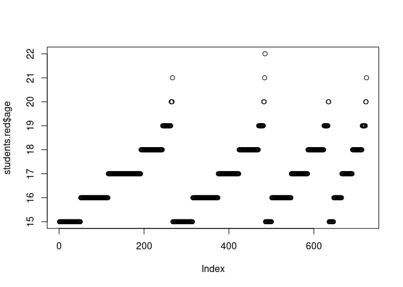
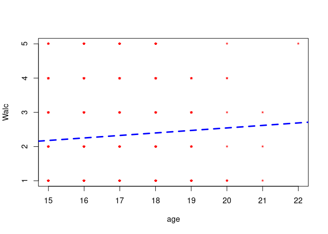
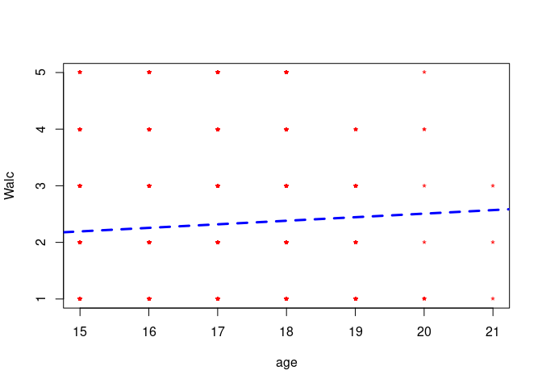
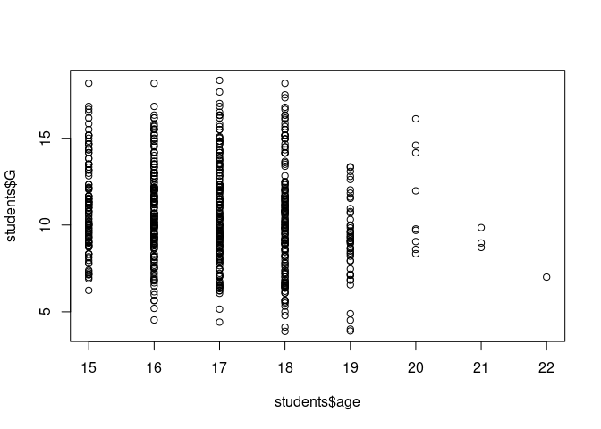
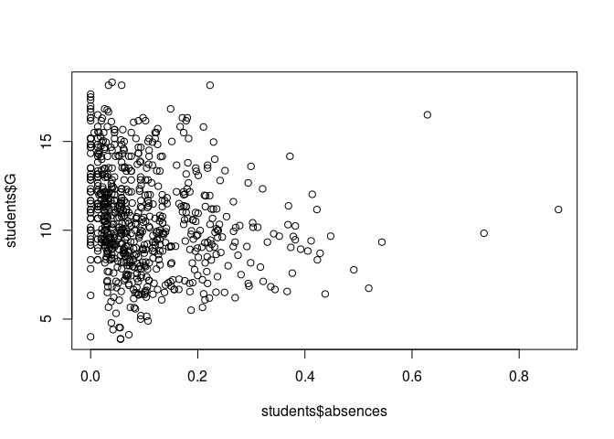
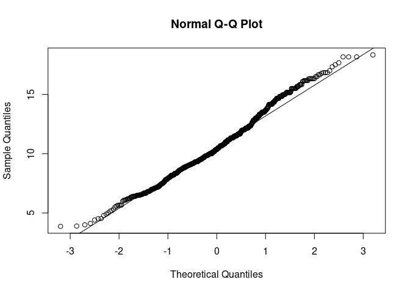

# Introducción

Este documento hace referencia a la PRAC2 de la asignatura Tipología y Ciclo de la Vida de los Datos. Ha sido desarrollada por:

* Gregorio Andrés García Menéndez (gagarcia)
* Manuel Gómez Montero (megmontero)

Tras este apartado de introducción donde se explican el dataset y el objetivo de nuestra práctica, primero se encuentra un apartado de limpieza de los datos en el que preparamos el dataset para los posteriores estudios explicados en los apartados a continuación. Por último, se obtienen una serie de conclusiones sobre los análisis y sobre la práctica

## Dataset

El dataset escogido contiene información muy valiosa sobre el consumo de alcohol en estudiantes, enriquecido con muchos factores sociales y del entorno del estudiante. El dataset original puede consultarse en: https://www.kaggle.com/uciml/student-alcohol-consumption

## Objetivo

El objetivo de nuestro estudio es ver qué influencia tienen los distintos aspectos de los estudiantes en su consumo de alcohol. Aprovechando que también contamos con otra información muy útil como las calificaciones de los estudiantes, parte de nuestro estudio se basará en centrarnos en el desempeño académico de los alumnos.


# Limpieza de datos


## Lectura de datos 

El dataset original vienen dividido en dos ficheros: uno para estudiantes de matemáticas y otro para estudiantes de portugués.
Primero leemos ambos ficheros y mostramos resumen para matemáticas:


```r
students.mat=read.table("../data/student-mat.csv",sep=",",header=TRUE)
students.por=read.table("../data/student-por.csv",sep=",",header=TRUE)
summary(students.mat)
```

```
##  school   sex          age       address famsize   Pstatus      Medu      
##  GP:349   F:208   Min.   :15.0   R: 88   GT3:281   A: 41   Min.   :0.000  
##  MS: 46   M:187   1st Qu.:16.0   U:307   LE3:114   T:354   1st Qu.:2.000  
##                   Median :17.0                             Median :3.000  
##                   Mean   :16.7                             Mean   :2.749  
##                   3rd Qu.:18.0                             3rd Qu.:4.000  
##                   Max.   :22.0                             Max.   :4.000  
##       Fedu             Mjob           Fjob            reason   
##  Min.   :0.000   at_home : 59   at_home : 20   course    :145  
##  1st Qu.:2.000   health  : 34   health  : 18   home      :109  
##  Median :2.000   other   :141   other   :217   other     : 36  
##  Mean   :2.522   services:103   services:111   reputation:105  
##  3rd Qu.:3.000   teacher : 58   teacher : 29                   
##  Max.   :4.000                                                 
##    guardian     traveltime      studytime        failures      schoolsup
##  father: 90   Min.   :1.000   Min.   :1.000   Min.   :0.0000   no :344  
##  mother:273   1st Qu.:1.000   1st Qu.:1.000   1st Qu.:0.0000   yes: 51  
##  other : 32   Median :1.000   Median :2.000   Median :0.0000            
##               Mean   :1.448   Mean   :2.035   Mean   :0.3342            
##               3rd Qu.:2.000   3rd Qu.:2.000   3rd Qu.:0.0000            
##               Max.   :4.000   Max.   :4.000   Max.   :3.0000            
##  famsup     paid     activities nursery   higher    internet  romantic 
##  no :153   no :214   no :194    no : 81   no : 20   no : 66   no :263  
##  yes:242   yes:181   yes:201    yes:314   yes:375   yes:329   yes:132  
##                                                                        
##                                                                        
##                                                                        
##                                                                        
##      famrel         freetime         goout            Dalc      
##  Min.   :1.000   Min.   :1.000   Min.   :1.000   Min.   :1.000  
##  1st Qu.:4.000   1st Qu.:3.000   1st Qu.:2.000   1st Qu.:1.000  
##  Median :4.000   Median :3.000   Median :3.000   Median :1.000  
##  Mean   :3.944   Mean   :3.235   Mean   :3.109   Mean   :1.481  
##  3rd Qu.:5.000   3rd Qu.:4.000   3rd Qu.:4.000   3rd Qu.:2.000  
##  Max.   :5.000   Max.   :5.000   Max.   :5.000   Max.   :5.000  
##       Walc           health         absences            G1       
##  Min.   :1.000   Min.   :1.000   Min.   : 0.000   Min.   : 3.00  
##  1st Qu.:1.000   1st Qu.:3.000   1st Qu.: 0.000   1st Qu.: 8.00  
##  Median :2.000   Median :4.000   Median : 4.000   Median :11.00  
##  Mean   :2.291   Mean   :3.554   Mean   : 5.709   Mean   :10.91  
##  3rd Qu.:3.000   3rd Qu.:5.000   3rd Qu.: 8.000   3rd Qu.:13.00  
##  Max.   :5.000   Max.   :5.000   Max.   :75.000   Max.   :19.00  
##        G2              G3       
##  Min.   : 0.00   Min.   : 0.00  
##  1st Qu.: 9.00   1st Qu.: 8.00  
##  Median :11.00   Median :11.00  
##  Mean   :10.71   Mean   :10.42  
##  3rd Qu.:13.00   3rd Qu.:14.00  
##  Max.   :19.00   Max.   :20.00
```

El resumen para alumnos de portugués: 


```r
summary(students.por)
```

```
##  school   sex          age        address famsize   Pstatus
##  GP:423   F:383   Min.   :15.00   R:197   GT3:457   A: 80  
##  MS:226   M:266   1st Qu.:16.00   U:452   LE3:192   T:569  
##                   Median :17.00                            
##                   Mean   :16.74                            
##                   3rd Qu.:18.00                            
##                   Max.   :22.00                            
##       Medu            Fedu             Mjob           Fjob    
##  Min.   :0.000   Min.   :0.000   at_home :135   at_home : 42  
##  1st Qu.:2.000   1st Qu.:1.000   health  : 48   health  : 23  
##  Median :2.000   Median :2.000   other   :258   other   :367  
##  Mean   :2.515   Mean   :2.307   services:136   services:181  
##  3rd Qu.:4.000   3rd Qu.:3.000   teacher : 72   teacher : 36  
##  Max.   :4.000   Max.   :4.000                                
##         reason      guardian     traveltime      studytime    
##  course    :285   father:153   Min.   :1.000   Min.   :1.000  
##  home      :149   mother:455   1st Qu.:1.000   1st Qu.:1.000  
##  other     : 72   other : 41   Median :1.000   Median :2.000  
##  reputation:143                Mean   :1.569   Mean   :1.931  
##                                3rd Qu.:2.000   3rd Qu.:2.000  
##                                Max.   :4.000   Max.   :4.000  
##     failures      schoolsup famsup     paid     activities nursery  
##  Min.   :0.0000   no :581   no :251   no :610   no :334    no :128  
##  1st Qu.:0.0000   yes: 68   yes:398   yes: 39   yes:315    yes:521  
##  Median :0.0000                                                     
##  Mean   :0.2219                                                     
##  3rd Qu.:0.0000                                                     
##  Max.   :3.0000                                                     
##  higher    internet  romantic      famrel         freetime   
##  no : 69   no :151   no :410   Min.   :1.000   Min.   :1.00  
##  yes:580   yes:498   yes:239   1st Qu.:4.000   1st Qu.:3.00  
##                                Median :4.000   Median :3.00  
##                                Mean   :3.931   Mean   :3.18  
##                                3rd Qu.:5.000   3rd Qu.:4.00  
##                                Max.   :5.000   Max.   :5.00  
##      goout            Dalc            Walc          health     
##  Min.   :1.000   Min.   :1.000   Min.   :1.00   Min.   :1.000  
##  1st Qu.:2.000   1st Qu.:1.000   1st Qu.:1.00   1st Qu.:2.000  
##  Median :3.000   Median :1.000   Median :2.00   Median :4.000  
##  Mean   :3.185   Mean   :1.502   Mean   :2.28   Mean   :3.536  
##  3rd Qu.:4.000   3rd Qu.:2.000   3rd Qu.:3.00   3rd Qu.:5.000  
##  Max.   :5.000   Max.   :5.000   Max.   :5.00   Max.   :5.000  
##     absences            G1             G2              G3       
##  Min.   : 0.000   Min.   : 0.0   Min.   : 0.00   Min.   : 0.00  
##  1st Qu.: 0.000   1st Qu.:10.0   1st Qu.:10.00   1st Qu.:10.00  
##  Median : 2.000   Median :11.0   Median :11.00   Median :12.00  
##  Mean   : 3.659   Mean   :11.4   Mean   :11.57   Mean   :11.91  
##  3rd Qu.: 6.000   3rd Qu.:13.0   3rd Qu.:13.00   3rd Qu.:14.00  
##  Max.   :32.000   Max.   :19.0   Max.   :19.00   Max.   :19.00
```

## Unión de fuentes


Como apuntan en la web original del dataset, los ficheros de alumnos también contienen estudiantes que asisten a ambas clase, pero los registros de cada alumno no cuentan un algún tipo de identificador único. Por el contrario, especifican que para obtener los alumnos que se encuentran en ambas clases hay que unir ambos ficheros de alumnos en función de variables compartidas en los dos ficheros es decir: variables que tengan el mismo valor tanto en la clase de matemáticas como para la clase de portugués:


```r
students=merge(students.mat,students.por,by=c("school","sex","age","address","famsize","Pstatus","Medu","Fedu","Mjob","Fjob","reason","nursery","internet"))
summary(students)
```

```
##  school   sex          age        address famsize   Pstatus
##  GP:342   F:198   Min.   :15.00   R: 81   GT3:278   A: 38  
##  MS: 40   M:184   1st Qu.:16.00   U:301   LE3:104   T:344  
##                   Median :17.00                            
##                   Mean   :16.59                            
##                   3rd Qu.:17.00                            
##                   Max.   :22.00                            
##       Medu            Fedu             Mjob           Fjob    
##  Min.   :0.000   Min.   :0.000   at_home : 53   at_home : 16  
##  1st Qu.:2.000   1st Qu.:2.000   health  : 33   health  : 17  
##  Median :3.000   Median :3.000   other   :138   other   :211  
##  Mean   :2.806   Mean   :2.565   services: 96   services:107  
##  3rd Qu.:4.000   3rd Qu.:4.000   teacher : 62   teacher : 31  
##  Max.   :4.000   Max.   :4.000                                
##         reason    nursery   internet   guardian.x   traveltime.x  
##  course    :140   no : 72   no : 58   father: 91   Min.   :1.000  
##  home      :110   yes:310   yes:324   mother:275   1st Qu.:1.000  
##  other     : 34                       other : 16   Median :1.000  
##  reputation: 98                                    Mean   :1.442  
##                                                    3rd Qu.:2.000  
##                                                    Max.   :4.000  
##   studytime.x      failures.x     schoolsup.x famsup.x  paid.x   
##  Min.   :1.000   Min.   :0.0000   no :331     no :144   no :205  
##  1st Qu.:1.000   1st Qu.:0.0000   yes: 51     yes:238   yes:177  
##  Median :2.000   Median :0.0000                                  
##  Mean   :2.034   Mean   :0.2906                                  
##  3rd Qu.:2.000   3rd Qu.:0.0000                                  
##  Max.   :4.000   Max.   :3.0000                                  
##  activities.x higher.x  romantic.x    famrel.x      freetime.x   
##  no :181      no : 18   no :261    Min.   :1.00   Min.   :1.000  
##  yes:201      yes:364   yes:121    1st Qu.:4.00   1st Qu.:3.000  
##                                    Median :4.00   Median :3.000  
##                                    Mean   :3.94   Mean   :3.223  
##                                    3rd Qu.:5.00   3rd Qu.:4.000  
##                                    Max.   :5.00   Max.   :5.000  
##     goout.x          Dalc.x          Walc.x        health.x    
##  Min.   :1.000   Min.   :1.000   Min.   :1.00   Min.   :1.000  
##  1st Qu.:2.000   1st Qu.:1.000   1st Qu.:1.00   1st Qu.:3.000  
##  Median :3.000   Median :1.000   Median :2.00   Median :4.000  
##  Mean   :3.113   Mean   :1.474   Mean   :2.28   Mean   :3.579  
##  3rd Qu.:4.000   3rd Qu.:2.000   3rd Qu.:3.00   3rd Qu.:5.000  
##  Max.   :5.000   Max.   :5.000   Max.   :5.00   Max.   :5.000  
##    absences.x          G1.x            G2.x            G3.x      
##  Min.   : 0.000   Min.   : 3.00   Min.   : 0.00   Min.   : 0.00  
##  1st Qu.: 0.000   1st Qu.: 8.00   1st Qu.: 8.25   1st Qu.: 8.00  
##  Median : 3.000   Median :10.50   Median :11.00   Median :11.00  
##  Mean   : 5.319   Mean   :10.86   Mean   :10.71   Mean   :10.39  
##  3rd Qu.: 8.000   3rd Qu.:13.00   3rd Qu.:13.00   3rd Qu.:14.00  
##  Max.   :75.000   Max.   :19.00   Max.   :19.00   Max.   :20.00  
##   guardian.y   traveltime.y    studytime.y      failures.y     schoolsup.y
##  father: 91   Min.   :1.000   Min.   :1.000   Min.   :0.0000   no :332    
##  mother:275   1st Qu.:1.000   1st Qu.:1.000   1st Qu.:0.0000   yes: 50    
##  other : 16   Median :1.000   Median :2.000   Median :0.0000              
##               Mean   :1.445   Mean   :2.039   Mean   :0.1414              
##               3rd Qu.:2.000   3rd Qu.:2.000   3rd Qu.:0.0000              
##               Max.   :4.000   Max.   :4.000   Max.   :3.0000              
##  famsup.y  paid.y    activities.y higher.y  romantic.y    famrel.y    
##  no :143   no :356   no :182      no : 18   no :259    Min.   :1.000  
##  yes:239   yes: 26   yes:200      yes:364   yes:123    1st Qu.:4.000  
##                                                        Median :4.000  
##                                                        Mean   :3.942  
##                                                        3rd Qu.:5.000  
##                                                        Max.   :5.000  
##    freetime.y      goout.y          Dalc.y          Walc.y     
##  Min.   :1.00   Min.   :1.000   Min.   :1.000   Min.   :1.000  
##  1st Qu.:3.00   1st Qu.:2.000   1st Qu.:1.000   1st Qu.:1.000  
##  Median :3.00   Median :3.000   Median :1.000   Median :2.000  
##  Mean   :3.23   Mean   :3.118   Mean   :1.476   Mean   :2.291  
##  3rd Qu.:4.00   3rd Qu.:4.000   3rd Qu.:2.000   3rd Qu.:3.000  
##  Max.   :5.00   Max.   :5.000   Max.   :5.000   Max.   :5.000  
##     health.y       absences.y          G1.y            G2.y      
##  Min.   :1.000   Min.   : 0.000   Min.   : 0.00   Min.   : 5.00  
##  1st Qu.:3.000   1st Qu.: 0.000   1st Qu.:10.00   1st Qu.:11.00  
##  Median :4.000   Median : 2.000   Median :12.00   Median :12.00  
##  Mean   :3.576   Mean   : 3.673   Mean   :12.11   Mean   :12.24  
##  3rd Qu.:5.000   3rd Qu.: 6.000   3rd Qu.:14.00   3rd Qu.:14.00  
##  Max.   :5.000   Max.   :32.000   Max.   :19.00   Max.   :19.00  
##       G3.y      
##  Min.   : 0.00  
##  1st Qu.:11.00  
##  Median :13.00  
##  Mean   :12.52  
##  3rd Qu.:14.00  
##  Max.   :19.00
```

No obstante, pensamos que existen otro conjunto de variables que son únicas para cada estudiante independientemente del curso, como son el tiempo de camino al colegio, los suspensos anteriores si el alumno ha suspendido alguna asignatura anteriormente, si tiene soporte en el colegio, si realiza actividades extraescolares, si tiene pensado estudiar ... 

```r
students.both=merge(students.mat,students.por,by=c("school","sex","age","address","famsize","Pstatus","Medu","Fedu","Mjob","Fjob","reason","nursery","internet", "traveltime", "failures", "schoolsup", "activities", "higher", "romantic", "famrel", "freetime", "goout", "Dalc", "Walc", "health"))

summary(students.both)
```

```
##  school   sex          age        address famsize   Pstatus
##  GP:287   F:174   Min.   :15.00   R: 67   GT3:230   A: 31  
##  MS: 33   M:146   1st Qu.:16.00   U:253   LE3: 90   T:289  
##                   Median :16.00                            
##                   Mean   :16.52                            
##                   3rd Qu.:17.00                            
##                   Max.   :22.00                            
##       Medu            Fedu             Mjob           Fjob    
##  Min.   :0.000   Min.   :0.000   at_home : 44   at_home : 14  
##  1st Qu.:2.000   1st Qu.:2.000   health  : 30   health  : 15  
##  Median :3.000   Median :3.000   other   :116   other   :177  
##  Mean   :2.872   Mean   :2.622   services: 75   services: 87  
##  3rd Qu.:4.000   3rd Qu.:4.000   teacher : 55   teacher : 27  
##  Max.   :4.000   Max.   :4.000                                
##         reason    nursery   internet    traveltime       failures      
##  course    :118   no : 59   no : 48   Min.   :1.000   Min.   :0.00000  
##  home      : 87   yes:261   yes:272   1st Qu.:1.000   1st Qu.:0.00000  
##  other     : 30                       Median :1.000   Median :0.00000  
##  reputation: 85                       Mean   :1.428   Mean   :0.08125  
##                                       3rd Qu.:2.000   3rd Qu.:0.00000  
##                                       Max.   :4.000   Max.   :3.00000  
##  schoolsup activities higher    romantic      famrel         freetime    
##  no :277   no :150    no :  7   no :221   Min.   :1.000   Min.   :1.000  
##  yes: 43   yes:170    yes:313   yes: 99   1st Qu.:4.000   1st Qu.:3.000  
##                                           Median :4.000   Median :3.000  
##                                           Mean   :3.987   Mean   :3.203  
##                                           3rd Qu.:5.000   3rd Qu.:4.000  
##                                           Max.   :5.000   Max.   :5.000  
##      goout            Dalc            Walc           health     
##  Min.   :1.000   Min.   :1.000   Min.   :1.000   Min.   :1.000  
##  1st Qu.:2.000   1st Qu.:1.000   1st Qu.:1.000   1st Qu.:3.000  
##  Median :3.000   Median :1.000   Median :2.000   Median :4.000  
##  Mean   :3.069   Mean   :1.438   Mean   :2.225   Mean   :3.522  
##  3rd Qu.:4.000   3rd Qu.:2.000   3rd Qu.:3.000   3rd Qu.:5.000  
##  Max.   :5.000   Max.   :5.000   Max.   :5.000   Max.   :5.000  
##   guardian.x   studytime.x    famsup.x  paid.x      absences.x    
##  father: 74   Min.   :1.000   no :117   no :160   Min.   : 0.000  
##  mother:237   1st Qu.:1.000   yes:203   yes:160   1st Qu.: 0.000  
##  other :  9   Median :2.000                       Median : 4.000  
##               Mean   :2.084                       Mean   : 5.412  
##               3rd Qu.:3.000                       3rd Qu.: 7.250  
##               Max.   :4.000                       Max.   :75.000  
##       G1.x            G2.x            G3.x        guardian.y 
##  Min.   : 5.00   Min.   : 0.00   Min.   : 0.00   father: 74  
##  1st Qu.: 9.00   1st Qu.: 9.00   1st Qu.: 9.00   mother:237  
##  Median :11.00   Median :11.00   Median :11.00   other :  9  
##  Mean   :11.29   Mean   :11.18   Mean   :11.04               
##  3rd Qu.:14.00   3rd Qu.:14.00   3rd Qu.:14.00               
##  Max.   :19.00   Max.   :19.00   Max.   :20.00               
##   studytime.y    famsup.y  paid.y      absences.y          G1.y      
##  Min.   :1.000   no :117   no :300   Min.   : 0.000   Min.   : 0.00  
##  1st Qu.:1.000   yes:203   yes: 20   1st Qu.: 0.000   1st Qu.:11.00  
##  Median :2.000                       Median : 2.000   Median :12.00  
##  Mean   :2.084                       Mean   : 3.247   Mean   :12.39  
##  3rd Qu.:3.000                       3rd Qu.: 4.000   3rd Qu.:14.00  
##  Max.   :4.000                       Max.   :32.000   Max.   :19.00  
##       G2.y            G3.y      
##  Min.   : 5.00   Min.   : 0.00  
##  1st Qu.:11.00   1st Qu.:11.00  
##  Median :12.00   Median :13.00  
##  Mean   :12.57   Mean   :12.88  
##  3rd Qu.:14.00   3rd Qu.:15.00  
##  Max.   :19.00   Max.   :19.00
```

Vemos cuáles realmente serían del mismo conjunto


```r
print(nrow(students.both[students.both$guardian.y!=students.both$guardian.x,c("guardian.x", "guardian.y")]))
```

```
## [1] 0
```

```r
print(nrow(students.both[students.both$guardian.y!=students.both$guardian.x,c("famsup.x", "famsup.y")]))
```

```
## [1] 0
```

```r
print(nrow(students.both[students.both$studytime.y!=students.both$studytime.x,c("studytime.x", "studytime.y")]))
```

```
## [1] 0
```

```r
print(nrow(students.both[students.both$paid.y!=students.both$paid.x,c("paid.x", "paid.y")]))
```

```
## [1] 158
```

```r
print(nrow(students.both[students.both$absences.y!=students.both$absences.x,c("absences.x", "absences.y")]))
```

```
## [1] 235
```

Así, al unir según el criterio establecido nos queda el siguiente dataset:

```r
students.merge=merge(students.mat,students.por,by=c("school","sex","age","address","famsize","Pstatus","Medu","Fedu","Mjob","Fjob","reason","nursery","internet", "traveltime", "failures", "schoolsup", "activities", "higher", "romantic", "famrel", "freetime", "goout", "Dalc", "Walc", "health", "guardian", "famsup", "studytime"), all = TRUE,suffixes = c(".mat",".por"))
summary(students.merge)
```

```
##  school   sex          age        address famsize   Pstatus
##  GP:485   F:417   Min.   :15.00   R:218   GT3:508   A: 90  
##  MS:239   M:307   1st Qu.:16.00   U:506   LE3:216   T:634  
##                   Median :17.00                            
##                   Mean   :16.81                            
##                   3rd Qu.:18.00                            
##                   Max.   :22.00                            
##                                                            
##       Medu            Fedu             Mjob           Fjob    
##  Min.   :0.000   Min.   :0.000   at_home :150   at_home : 48  
##  1st Qu.:2.000   1st Qu.:1.000   health  : 52   health  : 26  
##  Median :2.000   Median :2.000   other   :283   other   :407  
##  Mean   :2.485   Mean   :2.285   services:164   services:205  
##  3rd Qu.:4.000   3rd Qu.:3.000   teacher : 75   teacher : 38  
##  Max.   :4.000   Max.   :4.000                                
##                                                               
##         reason    nursery   internet    traveltime       failures     
##  course    :312   no :150   no :169   Min.   :1.000   Min.   :0.0000  
##  home      :171   yes:574   yes:555   1st Qu.:1.000   1st Qu.:0.0000  
##  other     : 78                       Median :1.000   Median :0.0000  
##  reputation:163                       Mean   :1.565   Mean   :0.3453  
##                                       3rd Qu.:2.000   3rd Qu.:0.0000  
##                                       Max.   :4.000   Max.   :3.0000  
##                                                                       
##  schoolsup activities higher    romantic      famrel         freetime  
##  no :648   no :378    no : 82   no :452   Min.   :1.000   Min.   :1.0  
##  yes: 76   yes:346    yes:642   yes:272   1st Qu.:4.000   1st Qu.:3.0  
##                                           Median :4.000   Median :3.0  
##                                           Mean   :3.913   Mean   :3.2  
##                                           3rd Qu.:5.000   3rd Qu.:4.0  
##                                           Max.   :5.000   Max.   :5.0  
##                                                                        
##      goout            Dalc            Walc           health     
##  Min.   :1.000   Min.   :1.000   Min.   :1.000   Min.   :1.000  
##  1st Qu.:2.000   1st Qu.:1.000   1st Qu.:1.000   1st Qu.:2.000  
##  Median :3.000   Median :1.000   Median :2.000   Median :4.000  
##  Mean   :3.195   Mean   :1.519   Mean   :2.311   Mean   :3.552  
##  3rd Qu.:4.000   3rd Qu.:2.000   3rd Qu.:3.000   3rd Qu.:5.000  
##  Max.   :5.000   Max.   :5.000   Max.   :5.000   Max.   :5.000  
##                                                                 
##    guardian   famsup      studytime    paid.mat    absences.mat   
##  father:169   no :287   Min.   :1.00   no  :214   Min.   : 0.000  
##  mother:491   yes:437   1st Qu.:1.00   yes :181   1st Qu.: 0.000  
##  other : 64             Median :2.00   NA's:329   Median : 4.000  
##                         Mean   :1.92              Mean   : 5.709  
##                         3rd Qu.:2.00              3rd Qu.: 8.000  
##                         Max.   :4.00              Max.   :75.000  
##                                                   NA's   :329     
##      G1.mat          G2.mat          G3.mat      paid.por  
##  Min.   : 3.00   Min.   : 0.00   Min.   : 0.00   no  :610  
##  1st Qu.: 8.00   1st Qu.: 9.00   1st Qu.: 8.00   yes : 39  
##  Median :11.00   Median :11.00   Median :11.00   NA's: 75  
##  Mean   :10.91   Mean   :10.71   Mean   :10.42             
##  3rd Qu.:13.00   3rd Qu.:13.00   3rd Qu.:14.00             
##  Max.   :19.00   Max.   :19.00   Max.   :20.00             
##  NA's   :329     NA's   :329     NA's   :329               
##   absences.por        G1.por         G2.por          G3.por     
##  Min.   : 0.000   Min.   : 0.0   Min.   : 0.00   Min.   : 0.00  
##  1st Qu.: 0.000   1st Qu.:10.0   1st Qu.:10.00   1st Qu.:10.00  
##  Median : 2.000   Median :11.0   Median :11.00   Median :12.00  
##  Mean   : 3.659   Mean   :11.4   Mean   :11.57   Mean   :11.91  
##  3rd Qu.: 6.000   3rd Qu.:13.0   3rd Qu.:13.00   3rd Qu.:14.00  
##  Max.   :32.000   Max.   :19.0   Max.   :19.00   Max.   :19.00  
##  NA's   :75       NA's   :75     NA's   :75      NA's   :75
```

```r
# Save the dataset temporaly 
write.table(students, "../data/students_merge.csv", sep=",", col.names=TRUE, row.names=TRUE, quote=TRUE, na="NA")
```


## Eliminación de NAs


Primeros creamos un nuevo dataset y unificamos la variable paid estableciendo el valor "yes" si el estudiante recibe clases de pago en alguna de las clases: 

```r
students.nonas <- students.merge[, c("school","sex","age","address","famsize","Pstatus","Medu","Fedu","Mjob","Fjob","reason","nursery","internet", "traveltime", "failures", "schoolsup", "activities", "higher", "romantic", "famrel", "freetime", "goout", "Dalc", "Walc", "health", "guardian", "famsup", "studytime", "G1.por", "G1.mat", "G2.por", "G2.mat", "G3.por", "G3.mat", "absences.mat", "absences.por")]
students.nonas$paid <- "no"
students.nonas$paid[NVL(students.merge$paid.mat == 'yes' | students.merge$paid.por == 'yes', FALSE)] <- "yes"
students.nonas$paid <- as.factor(students.nonas$paid)

summary(students.nonas)
```

```
##  school   sex          age        address famsize   Pstatus
##  GP:485   F:417   Min.   :15.00   R:218   GT3:508   A: 90  
##  MS:239   M:307   1st Qu.:16.00   U:506   LE3:216   T:634  
##                   Median :17.00                            
##                   Mean   :16.81                            
##                   3rd Qu.:18.00                            
##                   Max.   :22.00                            
##                                                            
##       Medu            Fedu             Mjob           Fjob    
##  Min.   :0.000   Min.   :0.000   at_home :150   at_home : 48  
##  1st Qu.:2.000   1st Qu.:1.000   health  : 52   health  : 26  
##  Median :2.000   Median :2.000   other   :283   other   :407  
##  Mean   :2.485   Mean   :2.285   services:164   services:205  
##  3rd Qu.:4.000   3rd Qu.:3.000   teacher : 75   teacher : 38  
##  Max.   :4.000   Max.   :4.000                                
##                                                               
##         reason    nursery   internet    traveltime       failures     
##  course    :312   no :150   no :169   Min.   :1.000   Min.   :0.0000  
##  home      :171   yes:574   yes:555   1st Qu.:1.000   1st Qu.:0.0000  
##  other     : 78                       Median :1.000   Median :0.0000  
##  reputation:163                       Mean   :1.565   Mean   :0.3453  
##                                       3rd Qu.:2.000   3rd Qu.:0.0000  
##                                       Max.   :4.000   Max.   :3.0000  
##                                                                       
##  schoolsup activities higher    romantic      famrel         freetime  
##  no :648   no :378    no : 82   no :452   Min.   :1.000   Min.   :1.0  
##  yes: 76   yes:346    yes:642   yes:272   1st Qu.:4.000   1st Qu.:3.0  
##                                           Median :4.000   Median :3.0  
##                                           Mean   :3.913   Mean   :3.2  
##                                           3rd Qu.:5.000   3rd Qu.:4.0  
##                                           Max.   :5.000   Max.   :5.0  
##                                                                        
##      goout            Dalc            Walc           health     
##  Min.   :1.000   Min.   :1.000   Min.   :1.000   Min.   :1.000  
##  1st Qu.:2.000   1st Qu.:1.000   1st Qu.:1.000   1st Qu.:2.000  
##  Median :3.000   Median :1.000   Median :2.000   Median :4.000  
##  Mean   :3.195   Mean   :1.519   Mean   :2.311   Mean   :3.552  
##  3rd Qu.:4.000   3rd Qu.:2.000   3rd Qu.:3.000   3rd Qu.:5.000  
##  Max.   :5.000   Max.   :5.000   Max.   :5.000   Max.   :5.000  
##                                                                 
##    guardian   famsup      studytime        G1.por         G1.mat     
##  father:169   no :287   Min.   :1.00   Min.   : 0.0   Min.   : 3.00  
##  mother:491   yes:437   1st Qu.:1.00   1st Qu.:10.0   1st Qu.: 8.00  
##  other : 64             Median :2.00   Median :11.0   Median :11.00  
##                         Mean   :1.92   Mean   :11.4   Mean   :10.91  
##                         3rd Qu.:2.00   3rd Qu.:13.0   3rd Qu.:13.00  
##                         Max.   :4.00   Max.   :19.0   Max.   :19.00  
##                                        NA's   :75     NA's   :329    
##      G2.por          G2.mat          G3.por          G3.mat     
##  Min.   : 0.00   Min.   : 0.00   Min.   : 0.00   Min.   : 0.00  
##  1st Qu.:10.00   1st Qu.: 9.00   1st Qu.:10.00   1st Qu.: 8.00  
##  Median :11.00   Median :11.00   Median :12.00   Median :11.00  
##  Mean   :11.57   Mean   :10.71   Mean   :11.91   Mean   :10.42  
##  3rd Qu.:13.00   3rd Qu.:13.00   3rd Qu.:14.00   3rd Qu.:14.00  
##  Max.   :19.00   Max.   :19.00   Max.   :19.00   Max.   :20.00  
##  NA's   :75      NA's   :329     NA's   :75      NA's   :329    
##   absences.mat     absences.por     paid    
##  Min.   : 0.000   Min.   : 0.000   no :515  
##  1st Qu.: 0.000   1st Qu.: 0.000   yes:209  
##  Median : 4.000   Median : 2.000            
##  Mean   : 5.709   Mean   : 3.659            
##  3rd Qu.: 8.000   3rd Qu.: 6.000            
##  Max.   :75.000   Max.   :32.000            
##  NA's   :329      NA's   :75
```


Para el resto de valores nulos utilizamos el método missForest que utiliza árboles de decisión para imputar los valores perdidos en variables tanto numéricas como categóricas. 


```r
mf <-missForest(students.nonas, maxiter = 10, ntree = 100, variablewise = FALSE,
                       decreasing = FALSE, verbose = FALSE,
                       mtry = floor(sqrt(ncol(students.nonas))), replace = TRUE,
                       classwt = NULL, cutoff = NULL, strata = NULL,
                       sampsize = NULL, nodesize = NULL, maxnodes = NULL,
                       xtrue = NA, parallelize = c('no', 'variables', 'forests'))
```

```
##   missForest iteration 1 in progress...done!
##   missForest iteration 2 in progress...done!
##   missForest iteration 3 in progress...done!
##   missForest iteration 4 in progress...done!
##   missForest iteration 5 in progress...done!
##   missForest iteration 6 in progress...done!
```

```r
students.nonas <- mf$ximp

summary(students.nonas)
```

```
##  school   sex          age        address famsize   Pstatus
##  GP:485   F:417   Min.   :15.00   R:218   GT3:508   A: 90  
##  MS:239   M:307   1st Qu.:16.00   U:506   LE3:216   T:634  
##                   Median :17.00                            
##                   Mean   :16.81                            
##                   3rd Qu.:18.00                            
##                   Max.   :22.00                            
##       Medu            Fedu             Mjob           Fjob    
##  Min.   :0.000   Min.   :0.000   at_home :150   at_home : 48  
##  1st Qu.:2.000   1st Qu.:1.000   health  : 52   health  : 26  
##  Median :2.000   Median :2.000   other   :283   other   :407  
##  Mean   :2.485   Mean   :2.285   services:164   services:205  
##  3rd Qu.:4.000   3rd Qu.:3.000   teacher : 75   teacher : 38  
##  Max.   :4.000   Max.   :4.000                                
##         reason    nursery   internet    traveltime       failures     
##  course    :312   no :150   no :169   Min.   :1.000   Min.   :0.0000  
##  home      :171   yes:574   yes:555   1st Qu.:1.000   1st Qu.:0.0000  
##  other     : 78                       Median :1.000   Median :0.0000  
##  reputation:163                       Mean   :1.565   Mean   :0.3453  
##                                       3rd Qu.:2.000   3rd Qu.:0.0000  
##                                       Max.   :4.000   Max.   :3.0000  
##  schoolsup activities higher    romantic      famrel         freetime  
##  no :648   no :378    no : 82   no :452   Min.   :1.000   Min.   :1.0  
##  yes: 76   yes:346    yes:642   yes:272   1st Qu.:4.000   1st Qu.:3.0  
##                                           Median :4.000   Median :3.0  
##                                           Mean   :3.913   Mean   :3.2  
##                                           3rd Qu.:5.000   3rd Qu.:4.0  
##                                           Max.   :5.000   Max.   :5.0  
##      goout            Dalc            Walc           health     
##  Min.   :1.000   Min.   :1.000   Min.   :1.000   Min.   :1.000  
##  1st Qu.:2.000   1st Qu.:1.000   1st Qu.:1.000   1st Qu.:2.000  
##  Median :3.000   Median :1.000   Median :2.000   Median :4.000  
##  Mean   :3.195   Mean   :1.519   Mean   :2.311   Mean   :3.552  
##  3rd Qu.:4.000   3rd Qu.:2.000   3rd Qu.:3.000   3rd Qu.:5.000  
##  Max.   :5.000   Max.   :5.000   Max.   :5.000   Max.   :5.000  
##    guardian   famsup      studytime        G1.por           G1.mat      
##  father:169   no :287   Min.   :1.00   Min.   : 0.000   Min.   : 3.000  
##  mother:491   yes:437   1st Qu.:1.00   1st Qu.: 9.345   1st Qu.: 7.958  
##  other : 64             Median :2.00   Median :11.000   Median : 9.210  
##                         Mean   :1.92   Mean   :11.280   Mean   :10.053  
##                         3rd Qu.:2.00   3rd Qu.:13.000   3rd Qu.:12.000  
##                         Max.   :4.00   Max.   :19.000   Max.   :19.000  
##      G2.por          G2.mat           G3.por          G3.mat      
##  Min.   : 0.00   Min.   : 0.000   Min.   : 0.00   Min.   : 0.000  
##  1st Qu.:10.00   1st Qu.: 7.940   1st Qu.:10.00   1st Qu.: 7.816  
##  Median :11.00   Median : 9.045   Median :12.00   Median : 9.250  
##  Mean   :11.45   Mean   : 9.842   Mean   :11.77   Mean   : 9.616  
##  3rd Qu.:13.00   3rd Qu.:12.000   3rd Qu.:14.00   3rd Qu.:12.000  
##  Max.   :19.00   Max.   :19.000   Max.   :19.00   Max.   :20.000  
##   absences.mat     absences.por     paid    
##  Min.   : 0.000   Min.   : 0.000   no :515  
##  1st Qu.: 2.000   1st Qu.: 0.000   yes:209  
##  Median : 5.180   Median : 2.000            
##  Mean   : 6.401   Mean   : 3.798            
##  3rd Qu.: 8.273   3rd Qu.: 6.000            
##  Max.   :75.000   Max.   :32.000
```

```r
ncol(students.nonas)
```

```
## [1] 37
```

## Análisis de  0s

Vamos a analizar uno por uno los casos en los que existen valores 0 y a definir si son valores posibles de la variable o por el contrario se trata de valores vacíos indicados como 0. Las variables que contienen valores 0 son: 


```r
students.numeric = select_if(students.nonas, is.numeric)
students.zerocolumns <- students.numeric[sapply(students.numeric, function(x) min(abs(x)))==0]
summary(students.zerocolumns)
```

```
##       Medu            Fedu          failures          G1.por      
##  Min.   :0.000   Min.   :0.000   Min.   :0.0000   Min.   : 0.000  
##  1st Qu.:2.000   1st Qu.:1.000   1st Qu.:0.0000   1st Qu.: 9.345  
##  Median :2.000   Median :2.000   Median :0.0000   Median :11.000  
##  Mean   :2.485   Mean   :2.285   Mean   :0.3453   Mean   :11.280  
##  3rd Qu.:4.000   3rd Qu.:3.000   3rd Qu.:0.0000   3rd Qu.:13.000  
##  Max.   :4.000   Max.   :4.000   Max.   :3.0000   Max.   :19.000  
##      G2.por          G2.mat           G3.por          G3.mat      
##  Min.   : 0.00   Min.   : 0.000   Min.   : 0.00   Min.   : 0.000  
##  1st Qu.:10.00   1st Qu.: 7.940   1st Qu.:10.00   1st Qu.: 7.816  
##  Median :11.00   Median : 9.045   Median :12.00   Median : 9.250  
##  Mean   :11.45   Mean   : 9.842   Mean   :11.77   Mean   : 9.616  
##  3rd Qu.:13.00   3rd Qu.:12.000   3rd Qu.:14.00   3rd Qu.:12.000  
##  Max.   :19.00   Max.   :19.000   Max.   :19.00   Max.   :20.000  
##   absences.mat     absences.por   
##  Min.   : 0.000   Min.   : 0.000  
##  1st Qu.: 2.000   1st Qu.: 0.000  
##  Median : 5.180   Median : 2.000  
##  Mean   : 6.401   Mean   : 3.798  
##  3rd Qu.: 8.273   3rd Qu.: 6.000  
##  Max.   :75.000   Max.   :32.000
```

Para el caso de la educación del padre y la madre ya definimos según se especificaba en el dataset original que el valor 0 significa que no poseen ningún tipo de educación.

Para el resto de casos vemos que el valor 0 también es posible ya que: 

* Es posible no haber suspendido ninguna asignatura, de hecho más del 75\% de alumnos así lo han hecho.
* En las calificaciones es posible sacar un 0. 
* En el caso de las ausencias también existen alumnos que no han faltado a ninguna clase. En el caso de las clases de portugués más del 25\%.


## Reducción de dimensionalidad

A continuación unificamos las calificaciones y las ausencias de ambas clases. En el caso de las calificaciones tiene sentido realizar la media entre ambas.


En primer lugar como no vamos a centrar los estudios comparando estudiantes de distintos colegios, eliminamos la variable School:

```r
students.red <- students.nonas[, c("sex","age","address","famsize","Pstatus","Medu","Fedu","Mjob","Fjob","reason","nursery","internet", "traveltime", "failures", "schoolsup", "activities", "higher", "romantic", "famrel", "freetime", "goout", "Dalc", "Walc", "health", "guardian", "famsup", "studytime", "paid")]
```


Para las calificaciones vamos a crear un único campo que contenga la media de todas las calificaciones obtenidas por el estudiante. 


```r
students.red$G <- rowMeans(students.nonas[c('G1.mat', 'G1.por','G2.mat', 'G2.por','G3.mat', 'G3.por' )])
summary(students.red)
```

```
##  sex          age        address famsize   Pstatus      Medu      
##  F:417   Min.   :15.00   R:218   GT3:508   A: 90   Min.   :0.000  
##  M:307   1st Qu.:16.00   U:506   LE3:216   T:634   1st Qu.:2.000  
##          Median :17.00                             Median :2.000  
##          Mean   :16.81                             Mean   :2.485  
##          3rd Qu.:18.00                             3rd Qu.:4.000  
##          Max.   :22.00                             Max.   :4.000  
##       Fedu             Mjob           Fjob            reason    nursery  
##  Min.   :0.000   at_home :150   at_home : 48   course    :312   no :150  
##  1st Qu.:1.000   health  : 52   health  : 26   home      :171   yes:574  
##  Median :2.000   other   :283   other   :407   other     : 78            
##  Mean   :2.285   services:164   services:205   reputation:163            
##  3rd Qu.:3.000   teacher : 75   teacher : 38                             
##  Max.   :4.000                                                           
##  internet    traveltime       failures      schoolsup activities higher   
##  no :169   Min.   :1.000   Min.   :0.0000   no :648   no :378    no : 82  
##  yes:555   1st Qu.:1.000   1st Qu.:0.0000   yes: 76   yes:346    yes:642  
##            Median :1.000   Median :0.0000                                 
##            Mean   :1.565   Mean   :0.3453                                 
##            3rd Qu.:2.000   3rd Qu.:0.0000                                 
##            Max.   :4.000   Max.   :3.0000                                 
##  romantic      famrel         freetime       goout            Dalc      
##  no :452   Min.   :1.000   Min.   :1.0   Min.   :1.000   Min.   :1.000  
##  yes:272   1st Qu.:4.000   1st Qu.:3.0   1st Qu.:2.000   1st Qu.:1.000  
##            Median :4.000   Median :3.0   Median :3.000   Median :1.000  
##            Mean   :3.913   Mean   :3.2   Mean   :3.195   Mean   :1.519  
##            3rd Qu.:5.000   3rd Qu.:4.0   3rd Qu.:4.000   3rd Qu.:2.000  
##            Max.   :5.000   Max.   :5.0   Max.   :5.000   Max.   :5.000  
##       Walc           health        guardian   famsup      studytime   
##  Min.   :1.000   Min.   :1.000   father:169   no :287   Min.   :1.00  
##  1st Qu.:1.000   1st Qu.:2.000   mother:491   yes:437   1st Qu.:1.00  
##  Median :2.000   Median :4.000   other : 64             Median :2.00  
##  Mean   :2.311   Mean   :3.552                          Mean   :1.92  
##  3rd Qu.:3.000   3rd Qu.:5.000                          3rd Qu.:2.00  
##  Max.   :5.000   Max.   :5.000                          Max.   :4.00  
##   paid           G         
##  no :515   Min.   : 3.565  
##  yes:209   1st Qu.: 8.833  
##            Median :10.338  
##            Mean   :10.668  
##            3rd Qu.:12.467  
##            Max.   :18.333
```


En el caso de las ausencias vamos a aplicar el mismo método. Sin embargo, antes de realizar la media vamos a normalizar para evitar que tengan más peso las ausencias en matemáticas:

```r
normalized<-function(y) {
  x<-y[!is.na(y)]
  x<-(x - min(x)) / (max(x) - min(x))
  y[!is.na(y)]<-x
  return(y)
}


students.red$absences <- rowMeans(sapply(students.nonas[c('absences.mat', 'absences.por')], normalized), na.rm=TRUE)

summary(students.red)  
```

```
##  sex          age        address famsize   Pstatus      Medu      
##  F:417   Min.   :15.00   R:218   GT3:508   A: 90   Min.   :0.000  
##  M:307   1st Qu.:16.00   U:506   LE3:216   T:634   1st Qu.:2.000  
##          Median :17.00                             Median :2.000  
##          Mean   :16.81                             Mean   :2.485  
##          3rd Qu.:18.00                             3rd Qu.:4.000  
##          Max.   :22.00                             Max.   :4.000  
##       Fedu             Mjob           Fjob            reason    nursery  
##  Min.   :0.000   at_home :150   at_home : 48   course    :312   no :150  
##  1st Qu.:1.000   health  : 52   health  : 26   home      :171   yes:574  
##  Median :2.000   other   :283   other   :407   other     : 78            
##  Mean   :2.285   services:164   services:205   reputation:163            
##  3rd Qu.:3.000   teacher : 75   teacher : 38                             
##  Max.   :4.000                                                           
##  internet    traveltime       failures      schoolsup activities higher   
##  no :169   Min.   :1.000   Min.   :0.0000   no :648   no :378    no : 82  
##  yes:555   1st Qu.:1.000   1st Qu.:0.0000   yes: 76   yes:346    yes:642  
##            Median :1.000   Median :0.0000                                 
##            Mean   :1.565   Mean   :0.3453                                 
##            3rd Qu.:2.000   3rd Qu.:0.0000                                 
##            Max.   :4.000   Max.   :3.0000                                 
##  romantic      famrel         freetime       goout            Dalc      
##  no :452   Min.   :1.000   Min.   :1.0   Min.   :1.000   Min.   :1.000  
##  yes:272   1st Qu.:4.000   1st Qu.:3.0   1st Qu.:2.000   1st Qu.:1.000  
##            Median :4.000   Median :3.0   Median :3.000   Median :1.000  
##            Mean   :3.913   Mean   :3.2   Mean   :3.195   Mean   :1.519  
##            3rd Qu.:5.000   3rd Qu.:4.0   3rd Qu.:4.000   3rd Qu.:2.000  
##            Max.   :5.000   Max.   :5.0   Max.   :5.000   Max.   :5.000  
##       Walc           health        guardian   famsup      studytime   
##  Min.   :1.000   Min.   :1.000   father:169   no :287   Min.   :1.00  
##  1st Qu.:1.000   1st Qu.:2.000   mother:491   yes:437   1st Qu.:1.00  
##  Median :2.000   Median :4.000   other : 64             Median :2.00  
##  Mean   :2.311   Mean   :3.552                          Mean   :1.92  
##  3rd Qu.:3.000   3rd Qu.:5.000                          3rd Qu.:2.00  
##  Max.   :5.000   Max.   :5.000                          Max.   :4.00  
##   paid           G             absences      
##  no :515   Min.   : 3.565   Min.   :0.00000  
##  yes:209   1st Qu.: 8.833   1st Qu.:0.03125  
##            Median :10.338   Median :0.06947  
##            Mean   :10.668   Mean   :0.10202  
##            3rd Qu.:12.467   3rd Qu.:0.13375  
##            Max.   :18.333   Max.   :0.87333
```


## Tipo de variables

Mostramos el tipo que actualmente tiene cada variable:

```r
sapply( students.red, class)
```

```
##        sex        age    address    famsize    Pstatus       Medu 
##   "factor"  "integer"   "factor"   "factor"   "factor"  "integer" 
##       Fedu       Mjob       Fjob     reason    nursery   internet 
##  "integer"   "factor"   "factor"   "factor"   "factor"   "factor" 
## traveltime   failures  schoolsup activities     higher   romantic 
##  "integer"  "integer"   "factor"   "factor"   "factor"   "factor" 
##     famrel   freetime      goout       Dalc       Walc     health 
##  "integer"  "integer"  "integer"  "integer"  "integer"  "integer" 
##   guardian     famsup  studytime       paid          G   absences 
##   "factor"   "factor"  "integer"   "factor"  "numeric"  "numeric"
```

En los tipos mostrados hay algunas variables que no tienen el tipo correcto. En la educación tanto de la madre como del padre consideramos que aunque se use un número para la representación debería ser un factor. Lo mismo ocurre para el tiempo de viaje o el tiempo de estudio. 


```r
students.red$Medu <-as.factor(students.red$Medu) 
students.red$Fedu <-as.factor(students.red$Fedu) 
students.red$traveltime <-as.factor(students.red$traveltime) 
students.red$studytime <-as.factor(students.red$studytime) 
```

La explicación de considerar el tiempo de estudio y el tiempo de viaje es que, aunque pueden parecer numéricas, en realizar son factores. En la descripción del dataset aparece explicado:

studytime: Weekly study time: (numeric: 1 - <2 hours, 2 - 2 to 5 hours, 3 - 5 to 10 hours, or 4 - >10 hours)
traveltime: Home to school travel time (numeric: 1 - <15 min., 2 - 15 to 30 min., 3 - 30 min. to 1 hour, or 4 - >1 hour)

Por lo tanto, al ser categorías, las tratamos como factores y no como numéricas.

## Análisis de Outliers

Para las variables numéricas realizamos un estudio de outliers. En nuestro caso, las variables a estudiar son "age" y "G". El resto de variables numéricas en realidad no lo son, puesto que son categóricas. Por ejemplo: "studytime" va de 1 a 4, y no hace referencia a las horas que el alumno pasa estudiando, sino que son categorías equivalentes a por ejemplo: Nada, Poco, Normal, Mucho. Podría haber valores erróneos debido a la transcripción de los datos o similar, pero dichos errores ya los hubiéramos detectado en la creación del data set, ya que gracias a la función "summary" vemos los valores mínimos y máximos y para estas variables categóricas numéricas no hay valores erróneos (mínimo y máximo corresponden a las categorías mínimas y máximas).

Procedemos al estudio de "age" y "G":


```r
plot(students.red$age)
```

<!-- -->

```r
plot(students.red$age, students.red$Walc, xlab="age", ylab="Walc", pch="*", col="red")
abline(lm(students.red$Walc ~ students.red$age), col="blue", lwd=3, lty=2)
```

<!-- -->

```r
age_no_outliers <- students.red$age[students.red$age <= 21]
walc_no_outliers <- students.red$Walc[students.red$age <= 21]
plot(age_no_outliers, walc_no_outliers, xlab="age", ylab="Walc", pch="*", col="red")
abline(lm(walc_no_outliers ~ age_no_outliers), col="blue", lwd=3, lty=2)
```

<!-- -->
Como podemos ver, para el campo edad los alumnos van de los 15 a los 22, siendo las franjas más pobladas los 15, 16 y 17 años. Al haber valores intermedios que en número van disminuyendo gradualmente desde los 18 hasta los 22, no consideramos ningún valor extremo (como el único estudiantes de 22 años) como valor erróneo. Además, al ser tan pocos estudiantes, no los descartamos en nuestros estudios ya que pueden aportar información valiosa, y como podemos ver en la comparativa del conjunto con outliers y sin outliers, no cambia de forma crítica.


```r
plot(students.red$G)
```

<!-- -->

```r
plot(students.red$G, students.red$Walc, xlab="G", ylab="Walc", pch="*", col="red")
abline(lm(students.red$Walc ~ students.red$G), col="blue", lwd=3, lty=2)
```

<!-- -->
En el caso de la media de la nota "G" es más claro todavía. Los datos no demuestran valores extremos que se puedan deber a errores, y aquellos más alejados de la mayor concentración de estudiantes son valores que aportan información para los estudios que vamos a realizar en cuanto al consumo de alcohol y de desempeño estudiantil.


## Dataset después de la limpieza

Así, después de la limpieza entera del dataset, este queda de la siguiente forma:


```r
summary(students.red)
```

```
##  sex          age        address famsize   Pstatus Medu    Fedu   
##  F:417   Min.   :15.00   R:218   GT3:508   A: 90   0:  7   0:  7  
##  M:307   1st Qu.:16.00   U:506   LE3:216   T:634   1:165   1:199  
##          Median :17.00                             2:205   2:235  
##          Mean   :16.81                             3:164   3:147  
##          3rd Qu.:18.00                             4:183   4:136  
##          Max.   :22.00                                            
##        Mjob           Fjob            reason    nursery   internet 
##  at_home :150   at_home : 48   course    :312   no :150   no :169  
##  health  : 52   health  : 26   home      :171   yes:574   yes:555  
##  other   :283   other   :407   other     : 78                      
##  services:164   services:205   reputation:163                      
##  teacher : 75   teacher : 38                                       
##                                                                    
##  traveltime    failures      schoolsup activities higher    romantic 
##  1:410      Min.   :0.0000   no :648   no :378    no : 82   no :452  
##  2:237      1st Qu.:0.0000   yes: 76   yes:346    yes:642   yes:272  
##  3: 59      Median :0.0000                                           
##  4: 18      Mean   :0.3453                                           
##             3rd Qu.:0.0000                                           
##             Max.   :3.0000                                           
##      famrel         freetime       goout            Dalc      
##  Min.   :1.000   Min.   :1.0   Min.   :1.000   Min.   :1.000  
##  1st Qu.:4.000   1st Qu.:3.0   1st Qu.:2.000   1st Qu.:1.000  
##  Median :4.000   Median :3.0   Median :3.000   Median :1.000  
##  Mean   :3.913   Mean   :3.2   Mean   :3.195   Mean   :1.519  
##  3rd Qu.:5.000   3rd Qu.:4.0   3rd Qu.:4.000   3rd Qu.:2.000  
##  Max.   :5.000   Max.   :5.0   Max.   :5.000   Max.   :5.000  
##       Walc           health        guardian   famsup    studytime
##  Min.   :1.000   Min.   :1.000   father:169   no :287   1:236    
##  1st Qu.:1.000   1st Qu.:2.000   mother:491   yes:437   2:346    
##  Median :2.000   Median :4.000   other : 64             3:106    
##  Mean   :2.311   Mean   :3.552                          4: 36    
##  3rd Qu.:3.000   3rd Qu.:5.000                                   
##  Max.   :5.000   Max.   :5.000                                   
##   paid           G             absences      
##  no :515   Min.   : 3.565   Min.   :0.00000  
##  yes:209   1st Qu.: 8.833   1st Qu.:0.03125  
##            Median :10.338   Median :0.06947  
##            Mean   :10.668   Mean   :0.10202  
##            3rd Qu.:12.467   3rd Qu.:0.13375  
##            Max.   :18.333   Max.   :0.87333
```

# Análisis Estadístico

En este apartado vamos a realizar varios estudios de tipo estadístico para ver qué relaciones y que influencias podemos obtener entre el consumo de alcohol y el resto de parámetros

## Análisis gráfico inicial


```r
vars = c("sex","age","address","famsize","Pstatus","Medu","Fedu","Mjob","Fjob","reason","nursery","internet", "traveltime", "failures", "schoolsup", "activities", "higher", "romantic", "famrel", "freetime", "goout", "health", "guardian", "famsup", "studytime", "absences", "paid", "G")


for(i in vars) {
  if(is.factor(students.red[,i])){
    var = students.red[,i]
    plot <- ggplot(data = students.red, aes(x = var, y = students.red[,"Walc"])) + 
            geom_boxplot(aes(fill = var), width = 0.8) + theme_bw()  +
            xlab(i) + ylab("Weekend Consumption")
    print(plot)
    plot <- ggplot(data = students.red, aes(x = var, y = students.red[,"Dalc"])) + 
            geom_boxplot(aes(fill = var), width = 0.8) + theme_bw()  +
            xlab(i) + ylab("Weekday Consumption")
    print(plot)
  }
}
```

<!-- --><!-- --><!-- --><!-- --><!-- --><!-- --><!-- --><!-- --><!-- --><!-- --><!-- --><!-- --><!-- --><!-- --><!-- --><!-- --><!-- --><!-- --><!-- --><!-- --><!-- --><!-- --><!-- --><!-- --><!-- --><!-- --><!-- --><!-- --><!-- --><!-- --><!-- --><!-- --><!-- --><!-- --><!-- --><!-- --><!-- --><!-- --><!-- --><!-- -->


Viendo las gráficas vemos que hay variables que parece que sí tienen influencia a simple vista en el consumo de alcohol tanto a diario como los fines de semana como pueden ser el sexo o el estado de los padres. Sin embargo vemos otros que, a priori, no parece que tengan influencia, así que en un primer momento vamos a dejar fuera del análisis si el alumno tiene internet, si está en una relación, el tutor, la dirección, si realiza actividades extraescolares, si recibe clases de pago, si ha ido a la guardería, o si recibe el apoyo de su familia en el estudio. 

El dataset resultante y con el que continuaremos trabajando es el siguiente: 


```r
students <- students.red[,c("sex","age","famsize","Pstatus","Medu","Fedu","Mjob","Fjob","reason", "traveltime", "failures", "schoolsup", "higher", "famsup", "famrel", "freetime", "goout", "Dalc", "Walc", "health", "studytime", "absences", "G")]
summary(students)
```

```
##  sex          age        famsize   Pstatus Medu    Fedu          Mjob    
##  F:417   Min.   :15.00   GT3:508   A: 90   0:  7   0:  7   at_home :150  
##  M:307   1st Qu.:16.00   LE3:216   T:634   1:165   1:199   health  : 52  
##          Median :17.00                     2:205   2:235   other   :283  
##          Mean   :16.81                     3:164   3:147   services:164  
##          3rd Qu.:18.00                     4:183   4:136   teacher : 75  
##          Max.   :22.00                                                   
##        Fjob            reason    traveltime    failures      schoolsup
##  at_home : 48   course    :312   1:410      Min.   :0.0000   no :648  
##  health  : 26   home      :171   2:237      1st Qu.:0.0000   yes: 76  
##  other   :407   other     : 78   3: 59      Median :0.0000            
##  services:205   reputation:163   4: 18      Mean   :0.3453            
##  teacher : 38                               3rd Qu.:0.0000            
##                                             Max.   :3.0000            
##  higher    famsup        famrel         freetime       goout      
##  no : 82   no :287   Min.   :1.000   Min.   :1.0   Min.   :1.000  
##  yes:642   yes:437   1st Qu.:4.000   1st Qu.:3.0   1st Qu.:2.000  
##                      Median :4.000   Median :3.0   Median :3.000  
##                      Mean   :3.913   Mean   :3.2   Mean   :3.195  
##                      3rd Qu.:5.000   3rd Qu.:4.0   3rd Qu.:4.000  
##                      Max.   :5.000   Max.   :5.0   Max.   :5.000  
##       Dalc            Walc           health      studytime
##  Min.   :1.000   Min.   :1.000   Min.   :1.000   1:236    
##  1st Qu.:1.000   1st Qu.:1.000   1st Qu.:2.000   2:346    
##  Median :1.000   Median :2.000   Median :4.000   3:106    
##  Mean   :1.519   Mean   :2.311   Mean   :3.552   4: 36    
##  3rd Qu.:2.000   3rd Qu.:3.000   3rd Qu.:5.000            
##  Max.   :5.000   Max.   :5.000   Max.   :5.000            
##     absences             G         
##  Min.   :0.00000   Min.   : 3.565  
##  1st Qu.:0.03125   1st Qu.: 8.833  
##  Median :0.06947   Median :10.338  
##  Mean   :0.10202   Mean   :10.668  
##  3rd Qu.:0.13375   3rd Qu.:12.467  
##  Max.   :0.87333   Max.   :18.333
```


## Estadistica Inferencial 

En este apartado vamos a ver si hay diferencia significativas en el consumo de alcohol a diario o fines de semana entre:

* Estudiantes de distinto sexo
* Estudiantes con diferente situación de convivencia de los padres.
* Estudiantes que aprueban (G >= 10) y estudiantes que suspenden (G < 10)  
  
Se trata de un problema de diferencia de medias entre dos muestras.


### Hipótesis

Para cada caso la hipótesis sería: 


$$
\left\{
\begin{array}{ll}
H_{0}: &  \mu_{g1}-\mu_{g2}=0\\
H_{1}: & \mu_{g1}-\mu_{g2}\ne0
\end{array}
\right.
$$

Se trata de un problema de diferencia de medias en el que no conocemos la varianza poblacional. Tampoco sabemos a priori si los datos siguen una distribución normal, pero el tamaño de las muestras es lo suficientemente grande para tener en cuenta el teorema del límite central.


### Comprobación de homocedasticidad
En cuanto a la varianza, podemos usar el test de Levene para comprobar si estas son iguales:


```r
aprobado <- as.factor(students$G >= 10)
LeveneTest(students$Dalc ~ students$sex)
```

```
## Levene's Test for Homogeneity of Variance (center = median)
##        Df F value    Pr(>F)    
## group   1  68.803 5.321e-16 ***
##       722                      
## ---
## Signif. codes:  0 '***' 0.001 '**' 0.01 '*' 0.05 '.' 0.1 ' ' 1
```

```r
LeveneTest(students$Walc ~ students$sex)
```

```
## Levene's Test for Homogeneity of Variance (center = median)
##        Df F value    Pr(>F)    
## group   1  46.682 1.776e-11 ***
##       722                      
## ---
## Signif. codes:  0 '***' 0.001 '**' 0.01 '*' 0.05 '.' 0.1 ' ' 1
```

```r
LeveneTest(students$Dalc ~ students$Pstatus)
```

```
## Levene's Test for Homogeneity of Variance (center = median)
##        Df F value Pr(>F)
## group   1  0.4882 0.4849
##       722
```

```r
LeveneTest(students$Walc ~ students$Pstatus)
```

```
## Levene's Test for Homogeneity of Variance (center = median)
##        Df F value Pr(>F)
## group   1   2e-04 0.9893
##       722
```

```r
LeveneTest(students$Dalc ~ aprobado)
```

```
## Levene's Test for Homogeneity of Variance (center = median)
##        Df F value    Pr(>F)    
## group   1   12.18 0.0005124 ***
##       722                      
## ---
## Signif. codes:  0 '***' 0.001 '**' 0.01 '*' 0.05 '.' 0.1 ' ' 1
```

```r
LeveneTest(students$Walc ~ aprobado)
```

```
## Levene's Test for Homogeneity of Variance (center = median)
##        Df F value   Pr(>F)   
## group   1  8.2494 0.004196 **
##       722                    
## ---
## Signif. codes:  0 '***' 0.001 '**' 0.01 '*' 0.05 '.' 0.1 ' ' 1
```

Consideramos igualdad de varianza unicamente para el estado de los padres. Para el resto de casos se asumirá heterocedasticidad.


### Realización de tests


Para el alcohol en fines de semana por sexo: 


```r
data_weekend_sex_m <- students$Walc[students$sex == 'M'] 
data_weekend_sex_f <- students$Walc[students$sex == 'F'] 

t.test(data_weekend_sex_m, data_weekend_sex_f,  conf.level = 0.95)
```

```
## 
## 	Welch Two Sample t-test
## 
## data:  data_weekend_sex_m and data_weekend_sex_f
## t = 9.3267, df = 543.51, p-value < 2.2e-16
## alternative hypothesis: true difference in means is not equal to 0
## 95 percent confidence interval:
##  0.7035395 1.0789615
## sample estimates:
## mean of x mean of y 
##  2.824104  1.932854
```
Por el p-value vemos que no podemos aceptar la hipótesis nula, y concluimos que al 95% de nivel de confianza los estudiantes masculinos y femeninos no tienen el mismo consumo de alcohol los fines de semana.  


Por sexo entre semana: 


```r
data_weekday_sex_m <- students$Dalc[students$sex == 'M'] 
data_weekday_sex_f <- students$Dalc[students$sex == 'F'] 

t.test(data_weekday_sex_m, data_weekday_sex_f,  conf.level = 0.95)
```

```
## 
## 	Welch Two Sample t-test
## 
## data:  data_weekday_sex_m and data_weekday_sex_f
## t = 7.6819, df = 453.19, p-value = 9.769e-14
## alternative hypothesis: true difference in means is not equal to 0
## 95 percent confidence interval:
##  0.4106079 0.6929158
## sample estimates:
## mean of x mean of y 
##  1.837134  1.285372
```

Por el p-value vemos que ocurre lo mismo que en los fines de semana. No podemos aceptar la hipotésis nula y al 95% afirmamos que hay diferencia en el consumo de alcohol entre estudiantes masculinos y femeninos para los días entre semana.


Ahora realizamos el estudio para el consumo de alcohol según la situación de los padres de cada alumno:

```r
data_weekday_pstatus_t <- students$Dalc[students$Pstatus == 'T'] 
data_weekday_pstatus_a <- students$Dalc[students$Pstatus == 'A'] 

t.test(data_weekday_pstatus_t, data_weekday_pstatus_a, var.equal = TRUE, conf.level = 0.95)
```

```
## 
## 	Two Sample t-test
## 
## data:  data_weekday_pstatus_t and data_weekday_pstatus_a
## t = 0.69872, df = 722, p-value = 0.4849
## alternative hypothesis: true difference in means is not equal to 0
## 95 percent confidence interval:
##  -0.1318160  0.2774872
## sample estimates:
## mean of x mean of y 
##  1.528391  1.455556
```
Con un p-value tan alto aceptamos la hipótesis nula, concluyendo que el consumo de alcohol entre semana es el mismo para estudiantes cuyos padres viven juntos y para estudiantes cuyos padres viven separados


```r
data_weekend_pstatus_t <- students$Walc[students$Pstatus == 'T'] 
data_weekend_pstatus_a <- students$Walc[students$Pstatus == 'A'] 

t.test(data_weekend_pstatus_t, data_weekend_pstatus_a, var.equal = TRUE, conf.level = 0.95)
```

```
## 
## 	Two Sample t-test
## 
## data:  data_weekend_pstatus_t and data_weekend_pstatus_a
## t = 1.3035, df = 722, p-value = 0.1928
## alternative hypothesis: true difference in means is not equal to 0
## 95 percent confidence interval:
##  -0.09613914  0.47601996
## sample estimates:
## mean of x mean of y 
##  2.334385  2.144444
```
En el caso del consumo en los fines de semana, ocurre lo mismo: no hay diferencias significativas en función del estado de convivencia de los padres


Por último, realizamos el estudio para el consumo de alcohol según las calificaciones que obtiene el alumno (si aprueba o suspende):

```r
data_weekday_aprobados <- students$Dalc[students$G >= 10] 
data_weekday_suspensos <- students$Dalc[students$G < 10] 

t.test(data_weekday_aprobados, data_weekday_suspensos,  conf.level = 0.95)
```

```
## 
## 	Welch Two Sample t-test
## 
## data:  data_weekday_aprobados and data_weekday_suspensos
## t = -3.4197, df = 620.49, p-value = 0.0006681
## alternative hypothesis: true difference in means is not equal to 0
## 95 percent confidence interval:
##  -0.3774441 -0.1020732
## sample estimates:
## mean of x mean of y 
##  1.413366  1.653125
```
Viendo el p-value, podemos decir al 95% que sí hay diferencias entre alumnos que aprueban y alumnos que suspenden en cuanto al consumo de alcohol entre semana.


En el caso del consumo los fines de semana:

```r
data_weekend_aprobados <- students$Walc[students$G >= 10] 
data_weekend_suspensos <- students$Walc[students$G < 10] 

t.test(data_weekend_aprobados, data_weekend_suspensos,  conf.level = 0.95)
```

```
## 
## 	Welch Two Sample t-test
## 
## data:  data_weekend_aprobados and data_weekend_suspensos
## t = -2.9652, df = 653.04, p-value = 0.003136
## alternative hypothesis: true difference in means is not equal to 0
## 95 percent confidence interval:
##  -0.47989547 -0.09751789
## sample estimates:
## mean of x mean of y 
##  2.183168  2.471875
```
Con un p-value menor que 0.05, al 95% de confianza afirmamos que también hay diferencia en el consumo de alcohol los fines de semana en función de si el alumno aprueba o no.


## Regresión 

En este apartado aplicaremos un modelo de regresión lineal múltiple que use como variables explicativas el sexo,
la frecuencia con la que el estudiante sale con amigos, la edad y como variable dependiente el consumo de alcohol los fines de semana. 

Al usar regresores cualitativos, es importante definir una categoría de referencia, para lo que usaremos la función de R *relevel* estableciendo la categoría "F" como referente para el sexo. El resultado lo almacenamos en una nueva variable.


```r
students$sexR <- relevel(students$sex, "F")
modelo <- lm(Walc ~  goout + sexR + age, data = students )
summary(modelo)
```

```
## 
## Call:
## lm(formula = Walc ~ goout + sexR + age, data = students)
## 
## Residuals:
##     Min      1Q  Median      3Q     Max 
## -2.5632 -0.8600 -0.1086  0.8219  4.0050 
## 
## Coefficients:
##             Estimate Std. Error t value Pr(>|t|)    
## (Intercept)  0.01328    0.55458   0.024    0.981    
## goout        0.41354    0.03571  11.580   <2e-16 ***
## sexRM        0.80044    0.08431   9.494   <2e-16 ***
## age          0.03788    0.03281   1.154    0.249    
## ---
## Signif. codes:  0 '***' 0.001 '**' 0.01 '*' 0.05 '.' 0.1 ' ' 1
## 
## Residual standard error: 1.116 on 720 degrees of freedom
## Multiple R-squared:  0.2595,	Adjusted R-squared:  0.2564 
## F-statistic: 84.12 on 3 and 720 DF,  p-value: < 2.2e-16
```

Los coeficientes obtenidos para cada variable son: 


Observando el coeficiente de determinación $R^{2}$ vemos que la proporción de variabilidad explicada por el modelo con respecto a la variabilidad total  es unicamente del 25%


Otro modelo lineal que podemos estudiar es el consumo de alcohol los fines de semana en función de cuánto sale el estudiante con amigos, cuánto bebe entre semana, su sexo y su edad

```r
students$sexR <- relevel(students$sex, "F")
modelo <- lm(Walc ~ goout + sexR + Dalc + age + studytime, data = students )
summary(modelo)
```

```
## 
## Call:
## lm(formula = Walc ~ goout + sexR + Dalc + age + studytime, data = students)
## 
## Residuals:
##     Min      1Q  Median      3Q     Max 
## -3.3612 -0.6851 -0.1506  0.6757  2.9050 
## 
## Coefficients:
##             Estimate Std. Error t value Pr(>|t|)    
## (Intercept)  0.68470    0.46989   1.457  0.14551    
## goout        0.29036    0.03079   9.432  < 2e-16 ***
## sexRM        0.38633    0.07596   5.086 4.67e-07 ***
## Dalc         0.69840    0.04102  17.026  < 2e-16 ***
## age         -0.02350    0.02786  -0.843  0.39927    
## studytime2  -0.14609    0.08144  -1.794  0.07326 .  
## studytime3  -0.26357    0.11429  -2.306  0.02139 *  
## studytime4  -0.46156    0.16851  -2.739  0.00632 ** 
## ---
## Signif. codes:  0 '***' 0.001 '**' 0.01 '*' 0.05 '.' 0.1 ' ' 1
## 
## Residual standard error: 0.934 on 716 degrees of freedom
## Multiple R-squared:  0.4842,	Adjusted R-squared:  0.4792 
## F-statistic: 96.03 on 7 and 716 DF,  p-value: < 2.2e-16
```
Como podemos ver, aspectos que influyen mucho en el modelo son:

* Que el alumno salga con amigos
* Que el alumno sea de sexo masculino
* Si el alumno bebe entre semana tenderá a beber más los fines de semana
* Cuanto más tiempo de estudio dedica el alumno, menos bebe

La edad no influye de forma significativa para el consumo de alcohol según el modelo.

En este caso, el modelo explica un 48% de la variabilidad en los datos.


## ANOVA 

Continuamos nuestro estudio analizando el de nivel de significancia de la relación entre la calificación que obtienen los alumnos y otro tipo de factores:

* Sexo
* Consumo de alcohol los fines de semana
* Consumo de alcohol entre semana
* Situación de los padres (cohabitando o no)
  
Al estudiar el nivel de relación entre una variable contínua (la nota) y variables categóricas (el resto), usamos el test ANOVA para obtener este nivel de significancia. Una vez realizado comprobaremos la adecuación del modelo  analizando la normalidad y homoscedasticidad de los residuos. 


```r
# Sexo
aov1 = aov(students$G ~ students$sex)
summary(aov1)
```

```
##               Df Sum Sq Mean Sq F value Pr(>F)
## students$sex   1      3   2.513   0.322  0.571
## Residuals    722   5634   7.803
```

```r
# Consumo de alcohol fines de semana
aov2 = aov(students$G ~ students$Walc)
summary(aov2)
```

```
##                Df Sum Sq Mean Sq F value   Pr(>F)    
## students$Walc   1    116  115.76   15.14 0.000109 ***
## Residuals     722   5521    7.65                     
## ---
## Signif. codes:  0 '***' 0.001 '**' 0.01 '*' 0.05 '.' 0.1 ' ' 1
```

```r
# Consumo de alcohol entre semana
aov3 = aov(students$G ~ students$Dalc)
summary(aov3)
```

```
##                Df Sum Sq Mean Sq F value   Pr(>F)    
## students$Dalc   1    121  120.51   15.77 7.86e-05 ***
## Residuals     722   5516    7.64                     
## ---
## Signif. codes:  0 '***' 0.001 '**' 0.01 '*' 0.05 '.' 0.1 ' ' 1
```

```r
# Situación de los padres
aov4 = aov(students.red$G ~ students.red$Pstatus)
summary(aov4)
```

```
##                       Df Sum Sq Mean Sq F value Pr(>F)
## students.red$Pstatus   1      0   0.003       0  0.985
## Residuals            722   5637   7.807
```

Como podemos observar, no hay significancia entre el sexo o el estado de convivencia de los padres y la calificación del estudiante.

### Estudio de normalidad

Para comprobar la normalidad usaremos el test de Shapiro–Wilk utilizando un nivel de confianza del 95\% por lo que consideraremos la normalidad en aquellos casos en los que el p-value se encuentre por debajor de 0.05. 


```r
shapiro.test(aov1$residuals)
```

```
## 
## 	Shapiro-Wilk normality test
## 
## data:  aov1$residuals
## W = 0.9893, p-value = 3.952e-05
```

```r
shapiro.test(aov2$residuals)
```

```
## 
## 	Shapiro-Wilk normality test
## 
## data:  aov2$residuals
## W = 0.99173, p-value = 0.0004532
```

```r
shapiro.test(aov3$residuals)
```

```
## 
## 	Shapiro-Wilk normality test
## 
## data:  aov3$residuals
## W = 0.99237, p-value = 0.0009011
```

```r
shapiro.test(aov4$residuals)
```

```
## 
## 	Shapiro-Wilk normality test
## 
## data:  aov4$residuals
## W = 0.98943, p-value = 4.485e-05
```

Con los resultados obtenidos vemos que podemos asumir la normalidad en todos los casos.

### Estudio de homoscedasticidad

Para comprobar la homocedasticidad usaremos el test de Levene, considerando que se produce siempre que el p-value se encuentre por encima de 0.05.  


```r
LeveneTest(aov1$residuals ~ students$sex)
```

```
## Levene's Test for Homogeneity of Variance (center = median)
##        Df F value Pr(>F)
## group   1  0.9451 0.3313
##       722
```

```r
LeveneTest(aov2$residuals ~ as.factor(students$Walc))
```

```
## Levene's Test for Homogeneity of Variance (center = median)
##        Df F value   Pr(>F)   
## group   4  3.3902 0.009262 **
##       719                    
## ---
## Signif. codes:  0 '***' 0.001 '**' 0.01 '*' 0.05 '.' 0.1 ' ' 1
```

```r
LeveneTest(aov3$residuals ~ as.factor(students$Dalc))
```

```
## Levene's Test for Homogeneity of Variance (center = median)
##        Df F value   Pr(>F)   
## group   4  4.1727 0.002392 **
##       719                    
## ---
## Signif. codes:  0 '***' 0.001 '**' 0.01 '*' 0.05 '.' 0.1 ' ' 1
```

```r
LeveneTest(aov4$residuals ~ students$Pstatus)
```

```
## Levene's Test for Homogeneity of Variance (center = median)
##        Df F value Pr(>F)
## group   1  0.1555 0.6935
##       722
```

En este caso, solo podemos asumir homocedasticidad para el sexo y el estado de los padres, por lo que para el resto de casos ante el incumplimiento de la condición de homoscedasticidad, se podría aplicar una transformación de los datos (logaritmo, función inversa,…), o, por ejemplo el método Anova con corrección de Welch, como haremos a continuación, que no asume igualdad de varianzas.

### Anova-welch

```r
#Consumo entre semana
oneway.test(G~Walc,
            data=students,
            var.equal=FALSE)
```

```
## 
## 	One-way analysis of means (not assuming equal variances)
## 
## data:  G and Walc
## F = 5.2893, num df = 4.00, denom df = 241.05, p-value = 0.0004233
```

```r
#Consumo fin de semana
oneway.test(G~Dalc,
            data=students,
            var.equal=FALSE)
```

```
## 
## 	One-way analysis of means (not assuming equal variances)
## 
## data:  G and Dalc
## F = 5.6489, num df = 4.000, denom df = 63.048, p-value = 0.0005968
```

Vemos que en ambos casos el p-value está por debajo del 0.05 por lo que podemos concluir que en ambos casos si hay una influencia significativa.

## Correlación de variables numéricas

Procedemos a realizar otro estudio interesante como es la correlación entre la nota y otras variables numéricas: edad del alumno, número de ausencias del alumno y número de veces que ha suspendido anteriormente. Estudiamos la distribución de las variables y la normalidad de las mismas.


```r
plot(students$age, students$G)
```

<!-- -->

```r
plot(students$absences, students$G)
```

<!-- -->

```r
plot(students$failures, students$G)
```

<!-- -->

```r
qqnorm(students$G)
qqline(students$G)
```

<!-- -->

```r
qqnorm(students$age)
qqline(students$age)
```

<!-- -->

```r
qqnorm(students$absences)
qqline(students$absences)
```

<!-- -->

```r
qqnorm(students$failures)
qqline(students$failures)
```

<!-- -->

La única que podemos asumir una distribución normal es la G. Para ver la correlación entre la G y el resto de variables podemos usar el test de Pearson, que no requiere asumir normalidad de las variables. Procedemos a ver la correlación, fijando nuestro nivel de confianza en un 95%:


```r
cor.test(students$G, students$age, method = "pearson", conf.level = 0.95)
```

```
## 
## 	Pearson's product-moment correlation
## 
## data:  students$G and students$age
## t = -4.1401, df = 722, p-value = 3.882e-05
## alternative hypothesis: true correlation is not equal to 0
## 95 percent confidence interval:
##  -0.22267298 -0.08030772
## sample estimates:
##        cor 
## -0.1522802
```

```r
cor.test(students$G, students$absences, method = "pearson", conf.level = 0.95)
```

```
## 
## 	Pearson's product-moment correlation
## 
## data:  students$G and students$absences
## t = -4.9522, df = 722, p-value = 9.143e-07
## alternative hypothesis: true correlation is not equal to 0
## 95 percent confidence interval:
##  -0.2508014 -0.1098372
## sample estimates:
##        cor 
## -0.1812501
```

```r
cor.test(students$G, students$failures, method = "pearson", conf.level = 0.95)
```

```
## 
## 	Pearson's product-moment correlation
## 
## data:  students$G and students$failures
## t = -12.116, df = 722, p-value < 2.2e-16
## alternative hypothesis: true correlation is not equal to 0
## 95 percent confidence interval:
##  -0.4698433 -0.3486302
## sample estimates:
##       cor 
## -0.411052
```
Al ser todos los p-value menores que nuestro nivel alpha (0.05), podemos concluir que hay una fuerte relación entre la edad del alumno y su desempeño académico. Ocurre lo mismo con la ausencias y el número de veces que el alumno ha fallado en el pasado.


# Conclusiones

En esta práctica hemos realizado de principio a fin un estudio completo basado un set de datos al que primero hemos tenido que transformar para evitar contar con datos erróneos y para adecuarlo a nuestros propósitos.

Una vez hemos tenido un dataset limpio y listo, podemos sacar las siguientes conclusiones según los análisis efectuados:

* A un 95% de confianza, los estudiantes masculinos y femeninos no tienen el mismo consumo de alcohol (de acuerdo al análisis diferencial con el test de Levene)
* A un 95% de confianza, no hay diferencia en el consumo de alcohol en función de la situación de convivencia de los padres (de acuerdo al análisis diferencial con el test de Levene)
* A un 95% de confianza, hay diferencia en el consumo de alcohol entre alumnos que aprueban y alumnos que suspenden (de acuerdo al análisis diferencial con el test de Levene)
* Según nuestro modelo lineal, influyen en el consumo de alcohol:
    * Que el alumno salga con amigos
    * Que el alumno sea de sexo masculino
    * Si el alumno bebe entre semana tenderá a beber más los fines de semana
    * Cuanto más tiempo de estudio dedica el alumno, menos bebe
    * La edad no influye de forma significativa para el consumo de alcohol según el modelo.
* Los test de ANOVA realizados apoyan la teoría de que hay una fuerte relación entre las notas de los alumnos y su consumo de alcohol
* En cuanto al desempeño académico, los factores numéricos con los que existe correlación son la edad, las ausencias y los suspensos anteriormente

Tras haber finalizado la práctica podemos comprender la importancia de contar con un set de datos adecuado y suficientemente potente como para poder sacar conclusiones basadas en el mismo, así como la rigurosidad de realizar todos los pasos, tests y análisis, tanto numéricos como visuales, para obtener conocimiento a lo largo del proceso.


